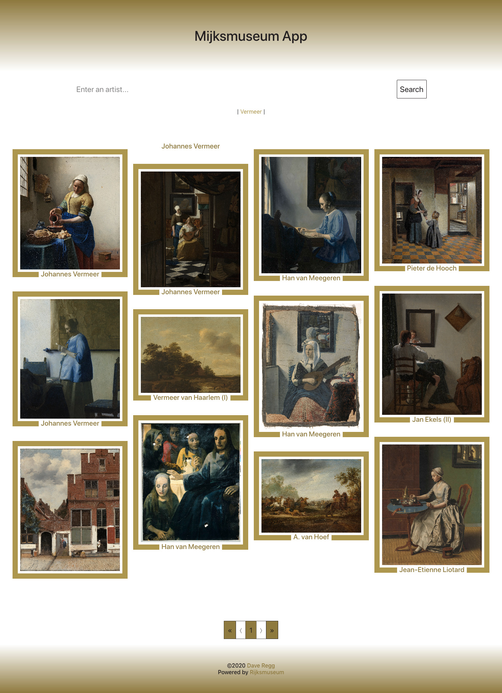

# Museum App
> Created with Create React App, powered by the Rijksmuseum public API to get information about painters and paintings.

## Table of contents
* [General info](#general-info)
* [Screenshots](#screenshots)
* [Technologies](#technologies)
* [Setup](#setup)
* [Features](#features)
* [Status](#status)
* [Inspiration](#inspiration)
* [License](#license)
* [Contact](#contact)

## General info
This project is created as a toy app to practice React and Redux. I wanted to play with an API and see how to interact between React and that API, while maintaining state using Redux. Users can interact with the API by searching for an artist or a piece of painting. The API will return results and render the pieces of artwork with the artist's name beneath it (I tried to make it look like a frame). The user can click a piece for more information, such as the artist's full name, description (if available), and the date.

## Screenshots


## Technologies
* Node - version 12.3.1
* React - version 16.13.1
* Axios - version 0.18.1
* Bootstrap - version 4.5.0
* React-js-pagination - version 3.0.3
* Express - version 4.17.1

## Setup
1. Clone the repo
```sh
git clone https://github.com/drregg6/museum-app.git
```
2. Install NPM packages
```sh
npm install
```
3. Retrieve API keys from [Rijksmuseum](https://www.rijksmuseum.nl/en)

## Features
List of features ready and TODOs for future development
* Desktop to mobile design
* Rijksmuseum API interaction

To-do list:
* Use Functional Components
* Revamp the CSS to make it easier on the eyes

## Status
_No longer continued_ although I would like to jump back in and revamp for a v2.0, it is not on my TODO list. v1.0 is _Launched_ [here](https://lit-beach-33230.herokuapp.com/)

## Inspiration
I needed an API to play with. As an art history major, I scoured through some museums until I found a public API!

## License
Distributed under the MIT License. See `LICENSE` for more information.

## Contact
Dave Regg - [@daveregg](https://www.twitter.com/daveregg) - dave.r.regg@gmail.com

Project Link: [https://github.com/drregg6/museum-app](https://github.com/drregg6/museum-app)